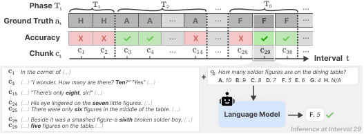

# OAKS: Online Adaptation to Continual Knowledge Streams

This repository hosts the data and code for the paper **"Can Large Language Models Keep Up? Benchmarking Online Adaptation to Continual Knowledge Streams"** ([arxiv](https://arxiv.org/abs/2603.07392)).


## Overview

Large language models operating in dynamic real-world contexts often encounter knowledge that evolves continuously or emerges incrementally. To remain accurate and effective, models must adapt to newly arriving information on the fly. We introduce **OAKS** to evaluate this capability — a benchmark for online adaptation over streaming, continually updating knowledge. Each model is evaluated at every time interval using the same set of questions, allowing us to assess whether it can track and reason over fine-grained knowledge dynamics across time. We present two datasets where individual facts evolve multiple times across context chunks, with dense annotations to measure whether models track changes accurately. 




---

## Data

| Dataset | Type | Context Length | Chunks | Avg. Answer Changes/Q |
|---|---|---|---|---|
| [OAKS-BABI](data/oaks-b/oaks-b.128k_split_2k.json) | Synthetic (BABILong-derived) | 128k tokens | 65 | 4.7 |
| [OAKS-Novel](data/oaks-n/oaks-n.split_2k.json) | Human-curated (novels) | ~150k tokens | ~78 | 4.7 |

- **OAKS-BABI (OAKS-B)**: A synthetic dataset derived from the BABILong benchmark. Questions focus on tracking, counting, bridge, and comparison across evolving facts. Contains 1.2k questions.
- **OAKS-Novel (OAKS-N)**: A human-curated dataset sourced from 19 public domain novels with rich narratives and dynamically interacting characters. Contains 870 multiple-choice questions (avg. 5.5 options).

Both files are JSON arrays where each element represents one document (story/book). Each element has the following structure:

```
{
  "meta": {
    "bid":        // unique document ID (e.g. "OAKSB00", "P31")
    "num_chunks": // total number of context chunks
    "num_qas":    // number of questions for this document
    // OAKS-N only:
    "title":      // book title
    "author":     // author name
  },
  "data": {
    "chunks": {             
      "<chunk_idx>": "..."  // key = chunk index, value = raw text (~2k tokens)
    },
    "facts": {              // OAKS-B only — structured facts introduced at each chunk
      "<chunk_idx>": ["fact sentence", ...]
    },
    "qas": {
      "<question text>": {
        "question_id": "...",         // format: "<bid>_q<idx>"
        "chunk_to_answer": {
          "<chunk_idx>": <answer>     // ground-truth answer valid after reading up to this chunk
                                      // OAKS-B: list of strings (open-ended)
                                      // OAKS-N: single string (one of the option labels)
        },
        // OAKS-N only:
        "options": ["option A", ...], // list of all answer choices
        "option_sources": {           // evidence sentences per option, keyed by chunk index
          "<option label>": { "<chunk_idx>": ["supporting sentence", ...] }
        },
        // OAKS-B only:
        "question_type": "simple_facts" | "counting" | "bridge" | "comparison"
      }
    }
  }
}
```

The key field is `chunk_to_answer`: it maps every chunk index to the correct answer given all context seen up to that point. This is what enables stepwise online evaluation — the model is queried after each new chunk arrives, and its prediction is compared against `chunk_to_answer[t]`.

---

## Code

### Installation

```
pip install -r installation.txt
```

### Base Run

The base setting concatenates all preceding context chunks up to the current time interval, truncating from the oldest when the model's context limit is exceeded.

**OAKS-BABI**
```bash
bash scripts/base_babi.sh
```

**OAKS-Novel**
```bash
bash scripts/base_novel.sh
```

#### Key Arguments

| Argument | Description |
|---|---|
| `--model` | HuggingFace model name or local path (e.g. `Qwen/Qwen3-30B-A3B-Instruct`) |
| `--corpus-file` | Path to the dataset JSON file |
| `--output` | Path for the output JSONL file |
| `--rolling` | If set, use only the most recent `N` chunks as context instead of the full accumulated history |
| `--max-doc-tokens` | Maximum token budget for the document context passed to the model |
| `--max-model-len` | Maximum total sequence length for the vLLM engine |
| `--max-tokens` | Maximum number of tokens to generate per answer |
| `--temperature` | Sampling temperature (default: `0.7`) |
| `--top-p` | Top-p nucleus sampling (default: `0.8`) |
| `--top-k` | Top-k sampling (default: `20`) |
| `--dtype` | Model weight dtype: `auto`, `bfloat16`, `float16`, `float32` (default: `bfloat16`) |
| `--gpu-memory-utilization` | Fraction of GPU memory vLLM may use (default: `0.8`) |
| `--batch-size` | Number of requests to batch together for generation |
| `--enable-thinking` | Enable thinking mode for supported models (e.g. Qwen3-Thinking variants) |
| `--system-prompt-file` | Path to a `.txt` file containing the system prompt |
| `--user-prompt-file` | Path to a `.txt` file containing the user prompt template |

### RAG Run

The RAG setting retrieves the top-k most relevant chunks from previous time intervals using a dense retriever (e.g. `Qwen3-Embedding-0.6B`) instead of concatenating the full context.

**Step 1: Build the retrieval index**
```bash
# Coming soon
```

**Step 2: Run inference with RAG**
```bash
# Add --rag-corpus-path and --rag-k to any base run script
python src/run_inference_vllm.py \
  --corpus-file data/oaks-b/oaks-b.128k_split_2k.json \
  --rag-corpus-path path/to/rag/index \
  --rag-k 30 \
  --output path/to/output/babi_rag.jsonl \
  [... other args ...]
```

| Argument | Description |
|---|---|
| `--rag-corpus-path` | Path to the directory containing precomputed RAG retrieval results |
| `--rag-k` | Number of top chunks to retrieve per query (default: `5`) |

---

## Citation

```bibtex
@article{kim2026oaks,
  title={Can Large Language Models Keep Up? Benchmarking Online Adaptation to Continual Knowledge Streams},
  author={Kim, Jiyeon and Lee, Hyunji and Zhou, Dylan and Park, Sue Hyun and Yoon, Seunghyun and Bui, Trung and Dernoncourt, Franck and Cha, Sungmin and Seo, Minjoon},
  journal={arXiv preprint arXiv:2603.07392},
  year={2026}
}
```
